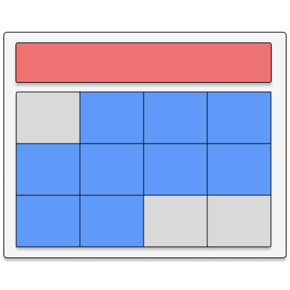

#  TinyCalendar

A browser extension to quickly find and open dates in Google Calendar. 

- [YouTube demo](https://youtu.be/xO-aMgUmfS8)


### Running the extension locally

First, run the development server:

```bash
npm install
npm run dev
```

Open your browser and load the appropriate development build. For example, if you are developing for the chrome browser, using manifest v3, use: `build/chrome-mv3-dev`.


### Making production build

```bash
npm run build
```

This should create a production bundle for your extension, ready to be zipped and published to the stores.

### Running tests

```bash
npm run test
```

### Author
Created by [Paul Treanor](https://paultreanor.com)

